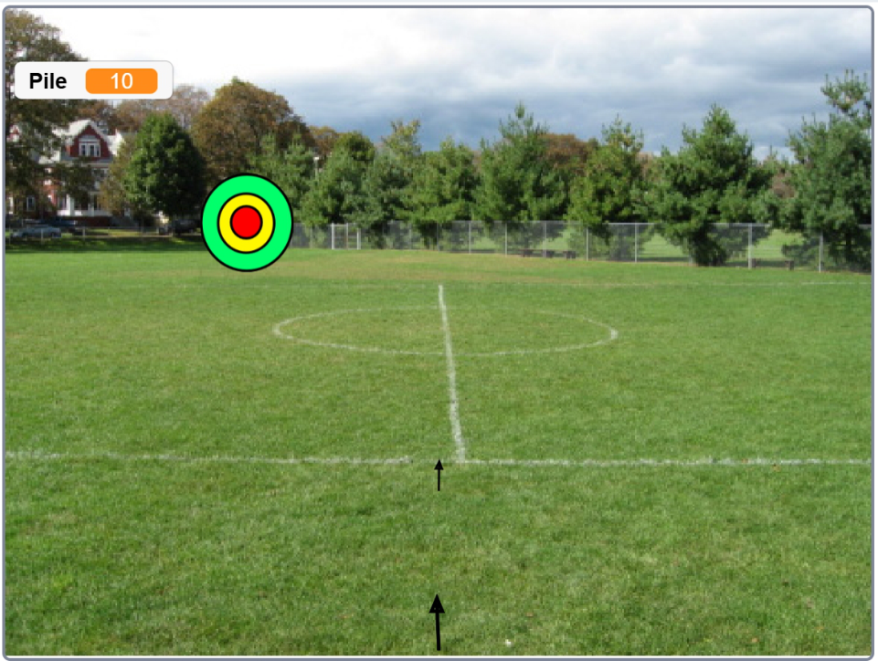
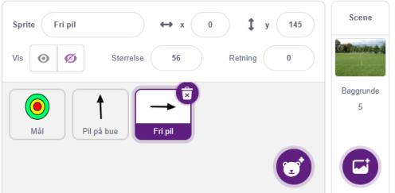
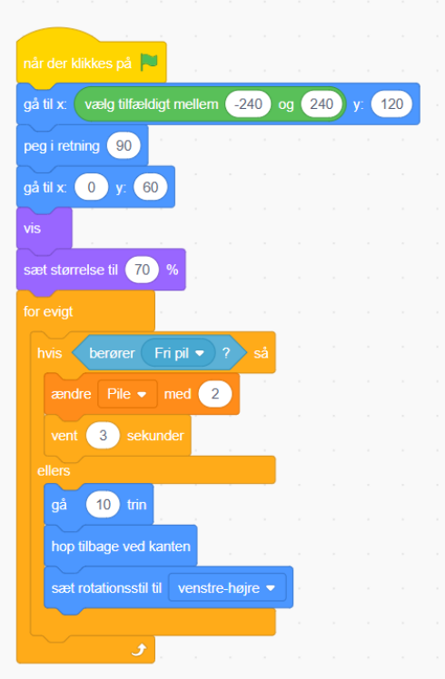
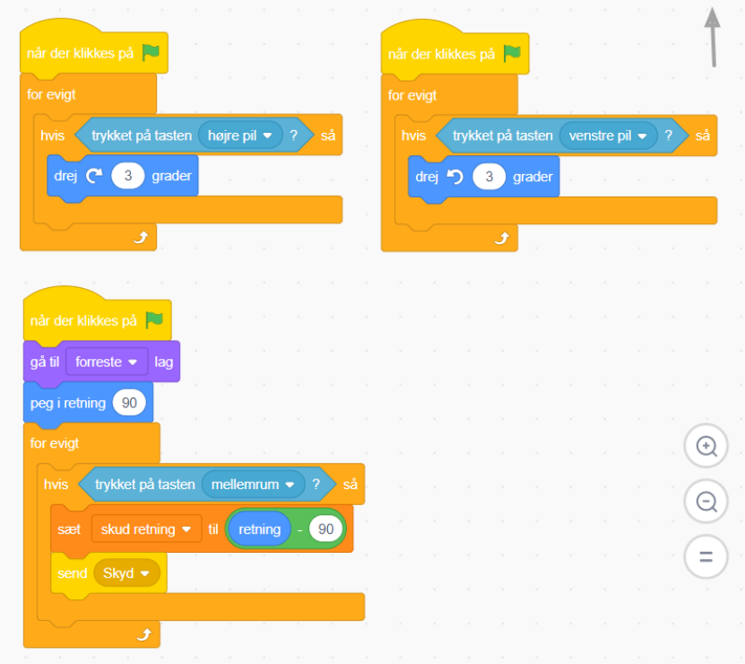
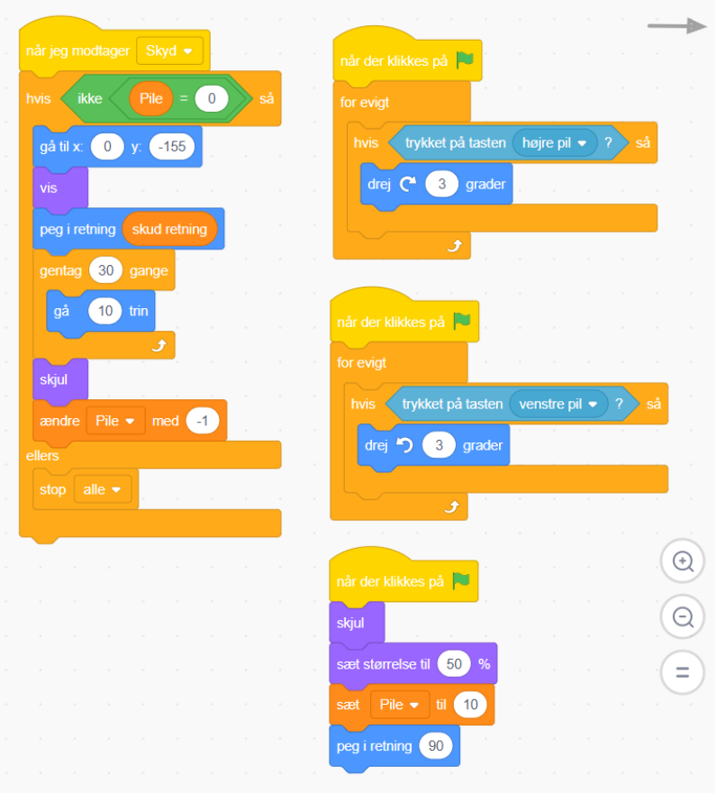

## **Med bue og pil** 

Skyd til måls med bue og pil. 

Sæt spillet i gang med det grønne flag. Drej bue og pil med **<=** eller **=>** Når du rammer skiven får du en ekstra pil. 

## Find en god baggrund! 

Tegn en sprite som en målskive. Husk at skivens centrum skal være i midten af billedet når du tegner. 

Tegn en sprite som en pil. Husk at pilens hoved skal være i midten af billedet når du tegner. 

Kopiér pil-spriten og vend den på siden.  Pilens hoved skal også her være i midten af billedet. 

Målskiven - sprite 

Pil på bue - sprite 

## Fri pil - sprite 

## Ekstraopgaver 

Mere 

Meget mere Meget meget mere 

