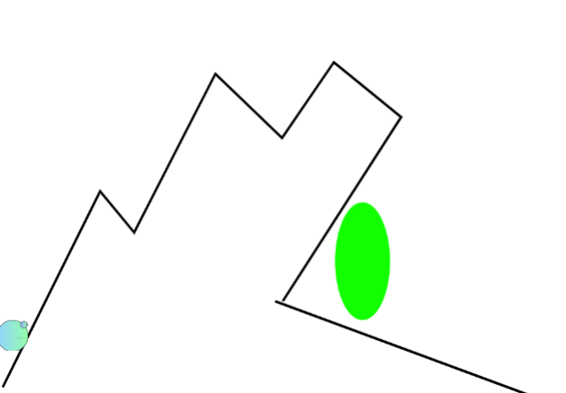
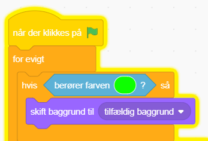
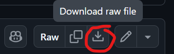

# 100 baner

Asa har lavet en spændende variant af
[Platform](./../Platform/README.md)-spillet:

**Der er 100 baner og så er der smarte portaler!**

Vejledningen minder om Platform-spillet, men der er ekstra lagt 100 forskellige
baner ind. Dem kan man lægge ind som kostumer på bagrunden.

En gang imellem er der en overraskelse: En portal.

En portal kunne se sådan her ud. Her er den grøn!

På programmeringen til ens superhelt i platformspillet kan man lave logik til
hvad der sker når man rammer portalen. Asa har besluttet at superhelten flyver
til en tilfældig bane.

Men du vælger selv hvad der skal ske!

Hvis du vil prøve spillet med de 100 baner, så kan du downloade det her og
indlæse det i din Pictoblox. HUSK at gemme dit eget først. Du downloader det ved
at trykke på pilen ned herinde [100 baner](100%20baner.sb3).

God fornøjelse! Og tak til Asa 🥳
