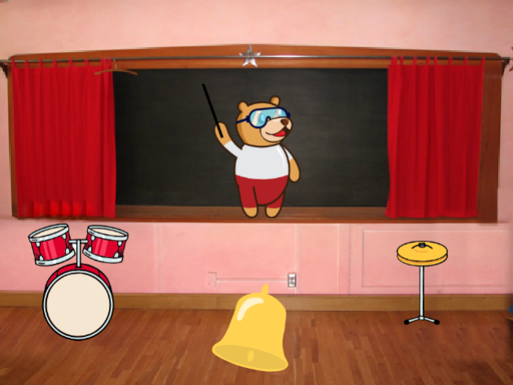

# Orkester

August har lavet denne øvelse - et orkester.

## Vejledning

### udvidelser

du skal lære om udvidelser

start med at klikke på knappen helt nede i venstre hjørne og vægl så en udvidelse

i denne øvelse er det musik udvidelsen der er brugt

## Ekstra øvelse

