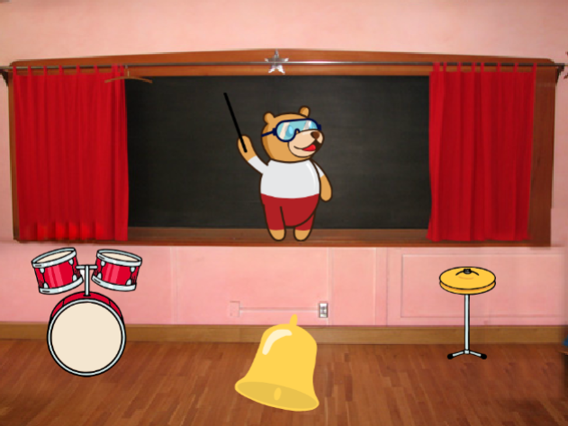
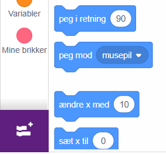
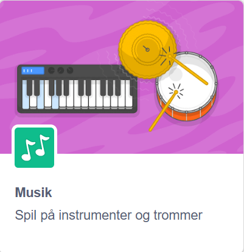
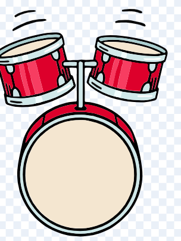
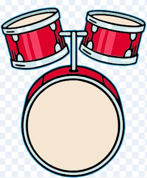

# Orkester

August har lavet denne øvelse - tobis orkester (med et spørgsmål fra tobi).

## Vejledning

### udvidelser

Du skal lære om udvidelser.

Start med at klikke på knappen helt nede i venstre hjørne og vægl så en udvidelse.

I denne øvelse er det musik udvidelsen der er brugt.

### indstrumenter og tobi

trommen har to kostymer

    

klokken har også to

det næste er bare spejlvendt

### progamering

vi starter med trommens kode. Den ser sådan her ud

## Ekstra øvelse

