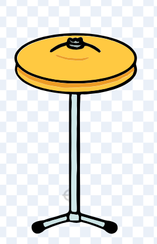
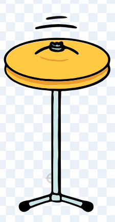
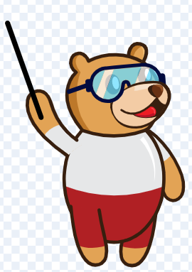
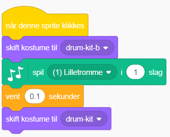
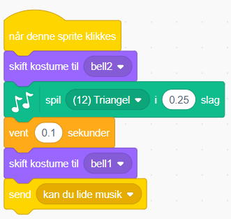
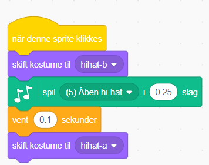
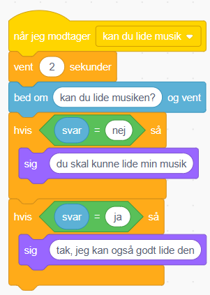

# Orkester

August har lavet denne øvelse - tobis orkester (med et spørgsmål fra tobi).

## Vejledning

### udvidelser

Du skal lære om udvidelser.

Start med at klikke på knappen helt nede i venstre hjørne og vægl så en udvidelse.

I denne øvelse er det musik udvidelsen der er brugt.

### bagrund
Du må selv vælge.

### instrumenter og tobi

Trommen har to kostymer.

    

Klokken har også to.

Det næste er bare spejlvendt.

Til hihaten er der også to.

Tobi: man drejer lidt på hans arm og sætter en streg.

### progamering

Vi starter med trommens kode. Den ser sådan her ud.

Og klokkens.

Kan du se at der er en besked kodedel. Den skal bruges til tobis kode.

Hihattens kode ser sådan her ud.

Alle instumenternes koder gør så de siger en lyd.

Den sidste kode er tobis.

Den gør så han spørger om musikken er god.

## Ekstra øvelse 1 (nem)

Kan du lave defekte instrumeter også?

## Ekstra øvelse 2 (medium)

Kan du få tobi til at synge?

## færdig med det hele 🎉

* Prøv at finpudse det hele eller lav flere instrumenter (virkene).

* Lav en forhistorie fx. at tobi skal købe instrumenterne som en animation.