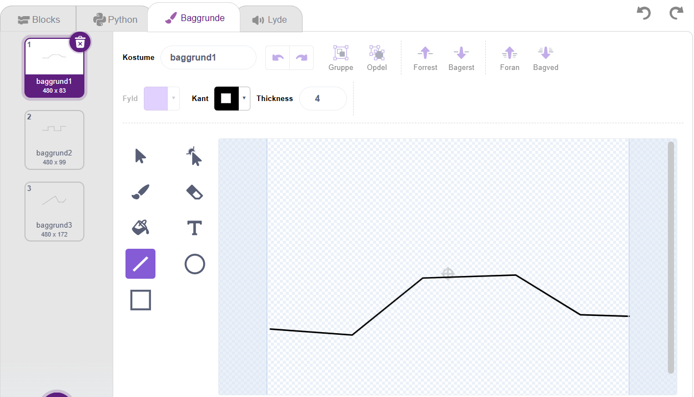
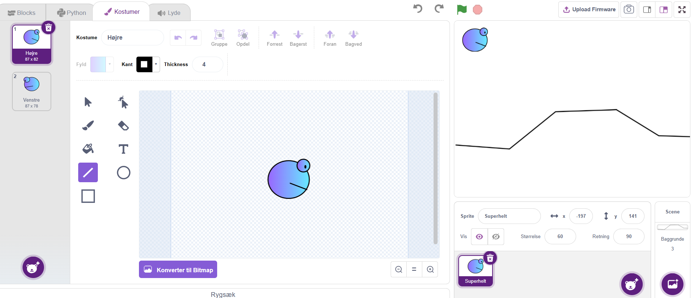
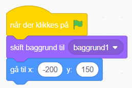
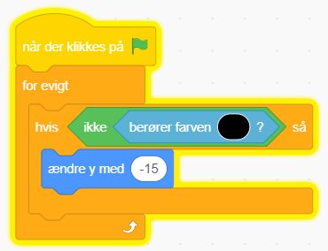
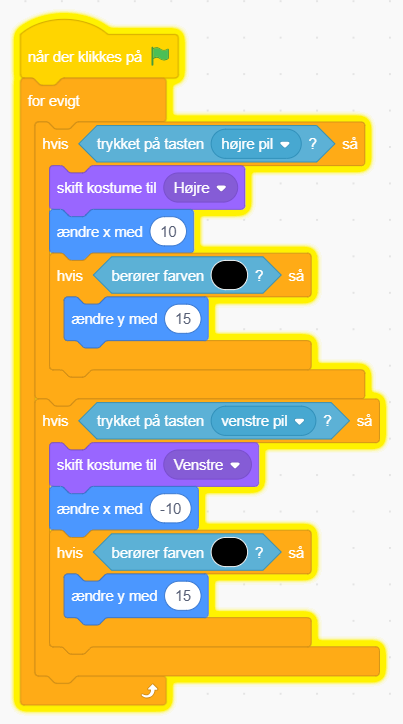
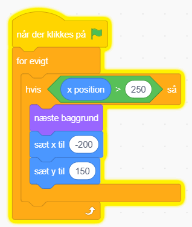

# Platform

Du skal lave et platform spil.

Det består af en superhelt og en bane som helten skal igennem. Til at starte med
kan superhelten bare gå frem og tilbage henover overfladen og når den kommer til
skærmens slutning kommer der en ny bane.

Når du er færdig, er der en masse ekstra du kan lave og du kan også sørge for at
lægge noget mad ud til superhelten, så han har noget at spise undervejs.

## Bagrunde

Først skal du tegne nogle baggrunde, start fx med tre.

Vi starter bare med en farve som bund. Det kunne være sort. Sørg for at der er
plads til at din superhelt kan starte ude til venstre.

## Superhelt

Du skal nu bruge en superhelt.

Superhelten skal være en sprit som har to kostumer:

- Et der kigger til Højre
- Et der kigger til Venstre.

Du skal tegne begge kostumer på samme sprite. Prøv at få dem til at have
nogenlunde samme størrelse, så det ikke ser (for) underligt ud.

Sæt din superhelt oppe i venstre hjørne.

## Programmering

### Start betingelse

Spillet skal altid starte med første baggrund.
Superhelten skal starte et godt sted i øverste venstre hjørne.

### Falde ned mod jorden

Superhelten skal falde ned mod jorden indtil den rammer den.

### Bevægelse mod højre og venstre

Superhelten skal styres med piltasterne.

Når den går mod højre skal den bruge det kostume. Når den går mod venstre skal
den bruge det andet.

Desuden skal den bevæge sig langs med jorden.

### Skift af bane/baggrund

Når superhelten kommer helt ud til højre skal den skifte bane/baggrund.

## Færdig 🥳 nu skal du selv finde på noget

Mulige ekstra opgaver

- **Forhindringer**: Det kunne være felter som superhelten kan dø på.
- **Hoppe**: Superhelten skal kunne hoppe over forhindringer.
- **Mål**: Når man kommer til sidste bane, skal der komme et MÅL-skilt.
- **Mad**: Der skal være noget at spise for superhelten undervejs.
- **Fjender**: Der skal gå fjender rundt som superhelten skal hoppe på.
- **Point**: Når superhelten spiser mad, smadrer fjender, klarer bane eller hvad
  du vil skal den tælle point sammen. Pointene skal stå på skærmen. Når den dør
  på felter eller kommer til at gå ind i fjender skal pointene gå ned.
- **Andet?**: Hvad vil du selv lave bedre?
