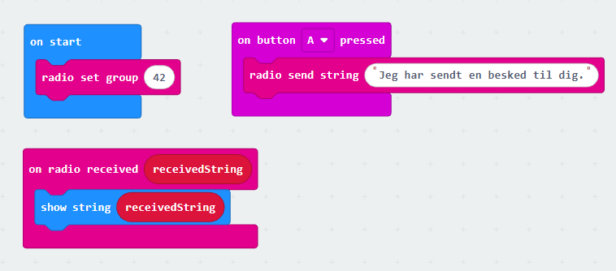
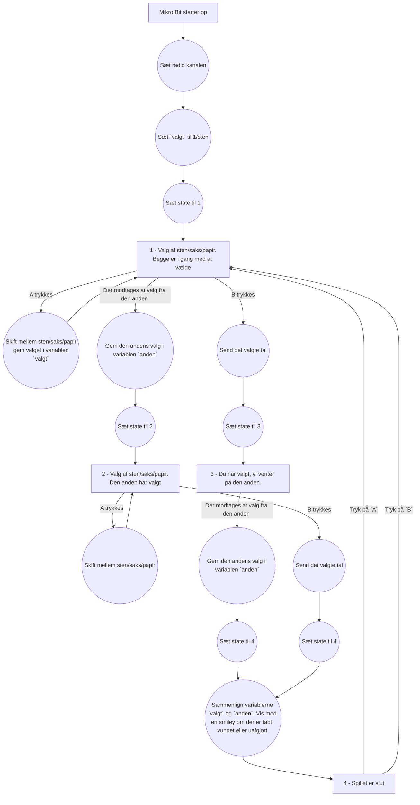

# Micro:Bit Radio 2

## Resultatet

I dag har vi to forskellige opgaver. De hænger ikke sammen, og det kan derfor vælges, hvilken opgave vi starter med.

De to opgaver er:
 * Sten saks papir med to Mikro:Bit
 * Hemmelige kodler mellem Mikro:Bit

Begge opgaver kan løses i [Makecode](https://makecode.microbit.org/#).

## Opgave 1 - Hemmelige koder mellem mikrobit
Vi skal prøve at lave et program der kan sende en tekst fra en mikrobit til den anden. Dette kan gøres med blokke, som det ses her:

Hvis dette program lægges ned på to Mikro:Bit kan i trykke på `A` på den ene Mikro:Bit og se at beskeden skrives på den anden Mikro:Bit.

En af de første øvelser vi lavede, handlede om at 'kryptere' en tekst så andre ikke kunne læse den. Løsningen til denne opgave kan findes [her](../Uge%202%20-%20Hemmelig%20kode/løsning.py). Beksrivelsen af hvordan vi kom frem til denne kode kan læses i [Uge 2](../Uge%202%20-%20Hemmelig%20kode/Hemmelig%20kode.md) opgaven.

 * Kan I rette koden til jeres Mikro:Bit til så den sender en "krypteret" tekst til den anden?

 * Kan i også rette koden til så den modtagne tekst bliver "af-krypteret" og vises korrekt på skærmen?
 
## Opgave 2 - Sten saks papir med to Mikro:Bit

Målet her er at lave et program der kan spille Sten saks Papir mellem to Mikro:Bit. Det var en ekstra-opgave sidste uge, men ingen nåede i mål med denne, så lad os prøve igen.

Programmet skal virke sådan at jeres Mikro:Bit skal starte op og vises et ikon der betyder `sten`. Hvis brugeren trykker på `A` skal der skiftes mellem `sten`, `saks` og `papir`.  
Når brugeren trykker `B` vælger man det skærmen viser. Man kan nu ikke længere skifte sit valg, og det valgte sendes til den andens Mikro:Bit.  
Når begge spillere har valgt noget skal skærmen om man har vist (Glad smiley) eller Tabt (Ked smiley).
Når brugeren trykker på `A` eller `B` startes et nyt spil, og skærmen viser igen en `sten` så brugeren kan vælge sit næste træk.

Det kan være en god ide at kode dette med blokke først.

Koden til at gøre dette benytter noget der hedder en `state-machine`. Det er noget kode der holder styr på hvad vi er i gang med i programmet.

I får ikke leveret noget kode til denne øvelse, men de forskellige states i får brug for er tegnet op her nedenfor.  
Firkanterne er en state, hvor vi venter på at noget sker.
Pilene med tekst på er noget der sker.
Teksten i cirklerne er det der skal ske.

I får brug for at oprette en variabel der hedder `state`. Når der sker ting (der modtages en besked over radio, eller der trykkes på en knap) er det state der skal bestemme hvad der sker.