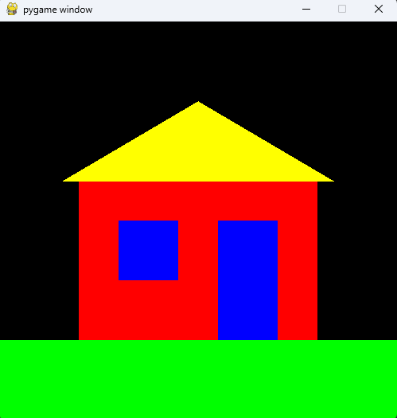

# Grafisk

## Resultatet

I dag skal vi ikke bruge Micro:Bit, men blot skrive noget python kode. 

Målet i dag er at lave noget grafik der kan vises på skærmen. Det er øvelse og leg.

Hvis man er meget hurtigt kan man måske nå at lave et lille spils

# Opstart - Lav et virtuelt python miljø og installer pygame.

Det kode vi skal arbejde med i dag stiller lidt krav til hvor vi lægger filerne. Koden skal ligge i sin egen mappe og skal oprettes som et `virtual environment`. 

> [!Warn] 
> Det er vigtigt at man sørger for at oprette et virtual environment. Ellers kan det give problemer med andre programmer på ens computer senere.

Sådan laver man et virtual environment:

1. Opret en mappe til din kode på din computer.
2. Åbn mappen i Visual Studio Code
3. Opret filen `main.py`
4. Skriv koden `print("hello world")` i filen og kør programmet.
5. Nederst i højre hjørner står der formentlig noget med `python 3.12`. Klik på dette og vælg `Create virtual environment`
6. Vælg `Quick create` for at oprette et virtuelt miljø. Hvis det virker oprettes der nu en mappe `.venv`.  
   Vi skal ikke bruge mappen aktivt, men den skla være der for at hjælpe os.
7. I hjørnet hvor der stod `Python 3.12` skal der nu gerne stå `.venv 3.12` eller noget i den retning.
8. Kør programemt igen. Der skulle nu gerne stå noget med `(.venv)` i starten af linjen i debug-vinduet.
9. Kør kommandoen `pip install pygame` i debug vinduet.

# Opstart - Kopier grund-koden.

Start med at se om du kan køre denne kode:

```python
import math
import pygame

WIDTH = 500
HEIGHT = 500

def main():
  pygame.init()

  screen = pygame.display.set_mode((WIDTH, HEIGHT))

  running = True
  while running:
    for event in pygame.event.get():
      if event.type == pygame.QUIT:
        running = False

    do_stuff()
    draw(screen)
    pygame.display.flip()

    pygame.time.Clock().tick(60)

  pygame.quit()

def do_stuff():
  print("Doing stuff")

def draw(screen):
  screen.fill((0,0,0))
  pygame.draw.line(screen, (255,0,0), (0,0), (WIDTH,HEIGHT))

if __name__ == "__main__":  main()
```

Hvis programmet virker, skulle det vise et vindue på skærmen. I vinduet er der en sort baggrund og en skrå rød streg.

# Farver
Lige nu er koden skrevet med farverne som tal-koder. En farve har tre tal som her:

```python
   (255, 0, 0)  # (red, green, blue)
```

Hver tal er mellem 0 og 255. OVenfor er rød altså på maks, og der er ingen grøn eller blå.

Koden bliver lettere at læse, hvis man giver sine farver navne, som her nedenfor:

```python
  color_black = (0,0,0)
  color_red = (255,0,0)
  color_green = (0, 255, 0)
  color_blue = (0, 0, 255)

  screen.fill(color_black)
  pygame.draw.line(screen, color_red, (0,0), (WIDTH,HEIGHT))
```

> [!NOTE]
> Kan du rettte koden til så den laver en gul streg i stedet for en rød?

# Pixels
Nu har vi prøvet at tegne en streg. Vi skal dog først lige lære at tenge en enkelt pixel ad gangen. Det kan gøres med denne kode:

```python
pygame.Surface.set_at(screen, (x, y), color)
```

Hvor `x` er koordinatet på X-aksen, `y` er koordinatet på Y-aksen og color er den farve vi ønsker at tegne.

Vi kan tegne den midterste pixel hvid med denne kode:
```python
pygame.Surface.set_at(screen, (WIDTH//2, HEIGHT//2), color_green)
```


> [!NOTE]
> Kan du finde ud af at sætte koden ind så den tegner en hvid plet midt i vinduet?

# Figurer
Her er nogle eksempler på hvordan vi kan tegne:

Pixels:
```python
  x = WIDTH//2
  y = HEIGHT//2
  pygame.Surface.set_at(screen, (x,y), color_green)
```

Firkant:
```python
  rect_left = WIDTH//2 - 55;
  rect_top = HEIGHT//2 - 55;
  rect_width = 110;
  rect_height = 110;
  pygame.draw.rect(screen, color_white, (rect_left, rect_top, rect_width, rect_height))
```

Polygon / N-kant:
```python
  punkter = []
  punkter.append((WIDTH//2 - 50, HEIGHT//2))
  punkter.append((WIDTH//2, HEIGHT//2 - 50))
  punkter.append((WIDTH//2 + 50, HEIGHT//2))
  pygame.draw.polygon(screen, color_red, punkter)
```

Cirkel:
```python
  circle_center = (WIDTH//2, HEIGHT//2)
  circle_radius = 50
  pygame.draw.circle(screen, color_blue, circle_center, circle_radius)
```

Cirkel-stykke:
```python
  rect_left = WIDTH//2 - 55;
  rect_top = HEIGHT//2 - 55;
  rect_width = 110;
  rect_height = 110;
  arc_start = 0   # 0 er til højre på cirklen
  arc_end = math.pi #math.pi er til venstre på cirklen
  pygame.draw.arc(screen, color_yellow, (rect_left, rect_top, rect_width, rect_height), arc_start, arc_end)
```

Kan du få alle de forskellige figurer til at virke?

# Opgave et lille hus

Kan du skrive dit eget program der tegner en børnetegning af et lille hus?

Her er min forsøg på en tegning:


# Opgave animation
Vi laver noget andet grafik. 

Man kan godt placere det i en anden fil, hvis man vil gemme det man har lavet.

Prøv at udskifte funktionerne `draw` og `do_stuff` med denne kode:
```python

# Class er lidt avanceret. Hvis du vil forstå den, spørg en underviser ;-)
class point:
  def __init__(self):
    self.x = random.randrange(0, WIDTH)
    self.y = random.randrange(0, HEIGHT)
    self.dx = random.randrange(-10, 10)
    self.dy = random.randrange(-10, 10)
    self.size = 5
    self.color = (255,255,255)

  def move(self):
    self.x += self.dx
    self.y += self.dy
    if self.x < 0 or self.x > WIDTH:
      self.dx = -self.dx
    if self.y < 0 or self.y > HEIGHT:
      self.dy = -self.dy

  def draw(self, screen):
    pygame.draw.circle(screen, self.color, (self.x, self.y), self.size)

points = [point() for _ in range(10)]

def draw(screen):
  screen.fill((0,0,0))
  for point in points: point.draw(screen)

def do_stuff():
  for point in points: point.move()
```

Kan du finde en måde at rette koden på, så der er 10 bolde i stedet for 3?

Kan du finde en måde at give alle boldende tilfældige farver?

Kan du finde en måde at give alle boldende tilfældige størrelser?