# Micro:Bit intro

## Resultatet

I dag skal vi starte op på at arbejde med Micro:Bit.
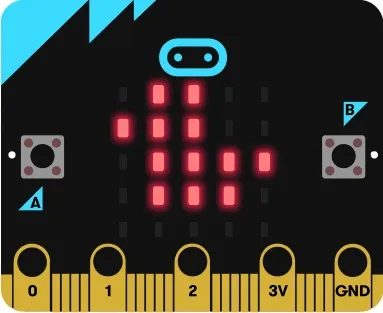

Man kan godt arbejde med Micro:Bit i [Pictoblox](http://pictoblox.ai), men der er andre sider som funugerer bedre, hvis man selv vil skrive koden. I dag benytter vi derfor:

[Makecode](https://makecode.microbit.org/#editor) fra Micro:Bit.

I dag er målet at lære hvad vores Mikro:Bit kan af forskellige ting.  
Vi skal blandt andet prøve følgende:
 * Tegne et billede vores Micro:Bit kan vise.
 * Programmere en animation på vores Micro:Bit.
 * Lave lyde med vores Micro:Bit

## Opgave 1 - Vis et billede på vores Micro:Bit.
Da dette er den første opgave vi prøver at lave på vores Micro:Bit, er der lidt ekstra hjælp.

Vi ønsker at vise en smiley på vores Micro:Bit:

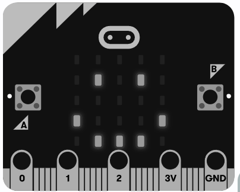

Dette kan gøres ved at placere følgende blokke:

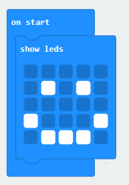

Sæt din Micro:Bit til computeren og klik på "Download".  
Får du det rigtige billede på din Micro:Bit?

## Opgave 2 - En animation med smiley

Vi prøver at lave noget med lidt flere blokke. Vi kan lave en smiley der skifter mellem glad og trist med disse blokke:

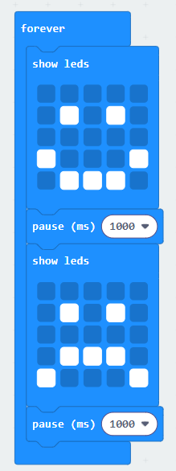

Hvis vi vil se hvordan koden til dette ser ud i python, kan vi se det ved at vælge kode oppe i toppen af skærmen:

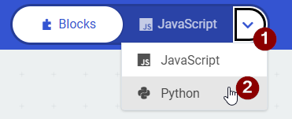

Start med at klikke på pilen (1) og vælg herefter "Python" (2).  
Hvis man er nysgerrig kan men også se hvordan koden ser ud i JavaScript, som er et andet kode-sprog.

## Opgave 3 - Lav en lyd
Her er et forslag til at lave lyde med en Micro:Bit:

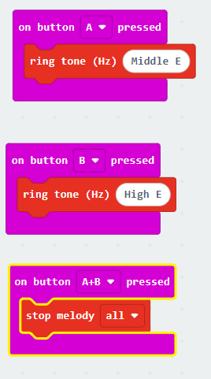

Virker det? Hvis ikke, kan du så finde en måde du kan lave lyd på og stoppe det igen?

Prøv at se hvordan koden til dette ser ud.

## Opgave 4 - Mere avanceret animation
Kan du finde en måde at lave en animation der gentager disse 4 billeder:

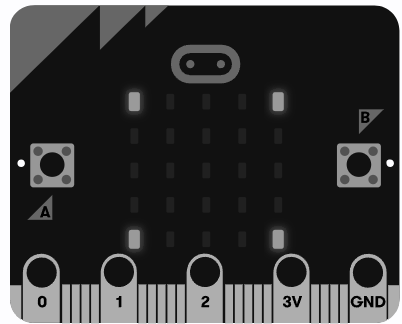
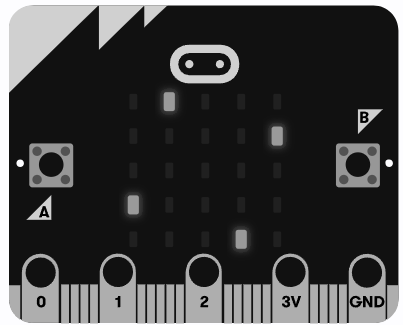
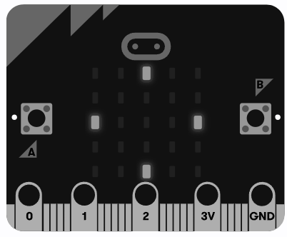
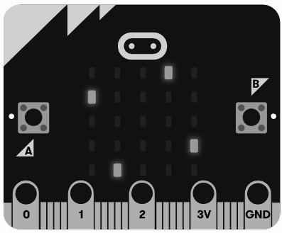

Det er nemt at lave animationen, hvis man bare tegner de fire billeder, men kan du lave det uden at tegne billederne?  
Det kan gøres ved at bruge blokkene:

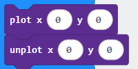

> [!TIP]  
> Måske det er lettest at starte med den pixel der starter øverst til højre, og så animere den.