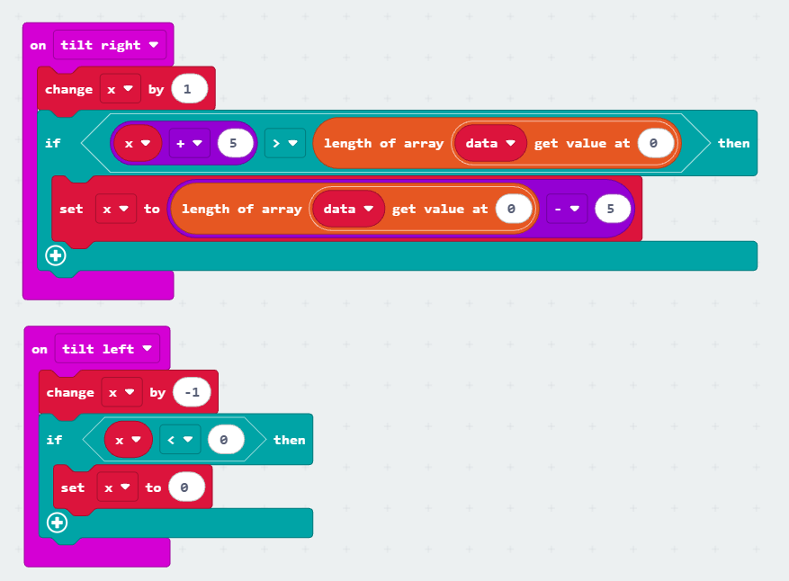

# Micro:Bit Radio 2

## Resultatet

I dag skal vi prøve at lave noget der er nemmere i kode end i blokke på en Micro:Bit.

Vi skal vise et billede på skærmen som er større en vores skærm. Vi kan som komme rundt på billedet ved at gøre dette:
 * Vip til venstre for at gå til venstre
 * Vip til højre for at gå til højre
 * Tryk A for at gå op
 * Tryk B for at gå ned

I får udleveret et billede, men skal selv se om i kan se billedet på jeres Micro:Bit og se hvad det er.

## Start
Det kan godt være svært at starte helt uden kode, så her er der noget kode der kan kopieres ind til at starte med:
```python
def on_button_pressed_a():
    pass
input.on_button_pressed(Button.A, on_button_pressed_a)

def on_gesture_tilt_left():
    pass
input.on_gesture(Gesture.TILT_LEFT, on_gesture_tilt_left)

def on_button_pressed_b():
    pass
input.on_button_pressed(Button.B, on_button_pressed_b)

def on_gesture_tilt_right():
    pass
input.on_gesture(Gesture.TILT_RIGHT, on_gesture_tilt_right)

def on_forever():
    pass
basic.forever(on_forever)

x = 0
y = 0
data = [[0, 0, 0, 0, 0]]
max_x = len(data[0]) - 5
max_y = len(data) - 5
```

Koden gør ikke noget endnu. Det skal i selv have den til.

## Billedet
I koden er billedet bare noget data, som lige nu står på linjen:
```python
data = [[0, 0, 0, 0, 0]]
```
Ret dette til:
```python
data = [
	[255,255,255,255,255,255,255,255,255,255,255,255,255,255,255,0,0,0,255,255,255,255,255,255,255,255,255,255,255,255],
	[255,255,255,255,255,255,255,255,255,255,255,255,255,255,0,0,0,0,0,255,255,255,255,255,255,255,255,255,255,255],
	[255,255,255,255,255,255,255,255,255,255,255,255,255,255,0,0,0,0,0,255,255,255,255,255,255,255,255,255,255,255],
	[255,255,255,255,255,255,255,255,255,255,255,255,255,255,0,0,0,0,0,255,255,255,255,255,255,255,255,255,255,255],
	[255,255,255,255,255,255,255,255,255,255,255,255,255,255,255,0,0,0,255,255,255,255,255,255,255,255,255,255,255,255],
	[255,255,255,255,255,255,255,255,255,255,255,255,255,0,255,255,255,255,255,255,255,255,255,255,255,255,255,255,255,255],
	[255,255,255,255,255,255,255,255,255,255,255,250,0,0,0,0,255,255,255,255,255,255,255,255,255,255,255,255,255,255],
	[255,255,255,255,255,255,255,255,255,255,255,0,0,0,0,0,0,255,255,255,255,255,255,255,255,255,255,255,255,255],
	[255,255,255,255,255,255,255,255,255,255,32,0,0,0,0,0,0,0,0,0,0,255,255,255,255,255,255,255,255,255],
	[255,255,255,255,255,255,255,255,255,255,0,0,0,0,0,0,0,0,0,0,0,0,255,255,255,255,255,255,255,255],
	[255,255,255,255,255,255,255,255,255,0,0,0,0,255,255,255,0,0,0,0,0,0,255,255,255,255,255,255,255,255],
	[255,255,255,255,255,255,255,255,255,0,0,0,0,255,255,255,255,0,0,0,0,255,255,255,255,255,255,255,255,255],
	[255,255,255,255,255,255,255,255,0,0,0,0,255,255,255,255,255,255,255,0,0,255,255,255,255,255,255,255,255,255],
	[255,255,255,255,255,255,255,255,0,0,0,0,0,64,255,255,1,0,0,0,0,255,255,255,255,255,255,255,255,255],
	[255,255,255,255,255,255,255,255,0,0,0,0,0,0,0,255,255,0,0,0,0,255,255,255,255,255,255,255,255,255],
	[255,255,255,255,255,255,255,255,255,255,0,0,0,0,0,0,255,255,255,0,0,0,255,255,255,255,255,255,255,255],
	[255,255,255,255,255,255,255,255,255,255,255,240,0,0,0,0,255,255,0,0,0,0,255,255,255,255,255,255,255,255],
	[255,255,255,255,255,255,255,255,255,0,255,255,0,0,0,0,255,0,0,0,72,0,255,255,255,255,255,255,255,255],
	[255,255,255,0,0,0,0,0,0,0,255,255,0,0,0,0,255,0,0,255,0,0,0,0,0,0,255,255,255,255],
	[255,0,0,0,255,255,255,0,0,0,255,255,0,0,0,0,255,0,255,0,0,0,0,255,208,0,0,0,255,255],
	[255,0,0,255,255,255,255,0,0,0,0,255,0,0,0,0,255,0,0,0,160,0,0,255,255,255,0,0,255,255],
	[0,0,255,255,255,255,0,0,255,255,0,255,0,0,0,0,255,255,0,0,255,255,0,32,255,255,255,0,0,255],
	[0,0,255,255,255,255,0,3,255,255,0,0,0,0,0,0,255,0,0,255,255,255,0,0,255,255,255,0,0,255],
	[0,0,255,255,255,0,0,0,0,0,0,0,0,0,0,103,255,0,0,255,255,255,0,0,255,255,255,0,0,255],
	[0,0,255,255,255,255,0,0,0,0,0,0,0,0,255,255,255,0,0,255,255,255,255,0,255,255,255,0,0,255],
	[0,0,255,255,255,255,255,255,255,255,0,4,255,255,255,255,255,0,0,255,255,255,255,255,255,255,255,0,0,255],
	[250,0,0,255,255,255,255,255,255,52,0,255,255,255,255,255,255,255,0,0,255,255,255,255,255,255,255,0,0,255],
	[255,0,0,0,255,255,255,255,18,0,0,255,255,255,255,255,255,255,255,0,0,255,255,255,255,255,0,0,255,255],
	[255,255,0,0,0,0,0,0,0,0,255,255,255,255,255,255,255,255,255,255,0,0,0,0,0,0,0,255,255,255],
	[255,255,255,240,0,0,0,0,0,255,255,255,255,255,255,255,255,255,255,255,255,0,0,0,0,0,255,255,255,255]
]
```

## Opdater skærmen
I funktionen `on_forever` står der lige nu bare `pass`. Her skal vi tælle igennem vores pixels på skærmen og tegne den del af billedet vi skal se.

`X` er der hvor vores skærm viser i billedet på X-aksen.
`Y` er der hvor vores skærm viser i billedet på Y-aksen.
`scr_x` er den pixel vi arbejder med på X-aksen.
`scr_y` er den pixel vi arbejder med på Y-aksen.

Vi tæller med `scr_x` og `scr_y` til 5 (fordi der er 5 x 5 pixels), og skriver den lysstyrke vores billede siger.

```python
    for scr_x in range(5):
        for scr_y in range(5):
            led.plot_brightness(scr_x, scr_y, data[scr_y + y][scr_x + x])
```

## Flyt billedet
I skal selv skrive koden til funktionerne:

 * `on_button_pressed_a`  
   Når a trykkes skal variablen `y` blive en mindre.  
   `y` må aldrig blive mindre end `0`.

 * `on_button_pressed_b`, 
   Når b trykkes skal variablen `y` blive en større.  
   `y` må aldrig blive større end `max_y`.

* `on_gesture_tilt_left`  
   Når der vippes til venstre skal variablen `x` blive en mindre.  
   `x` må aldrig blive mindre end `0`.

 * `on_gesture_tilt_right`, 
   Når der vippes til venstre skal variablen `x` blive en større.  
   `x` må aldrig blive større end `max_x`.

## Driller koden
Koden der skal laves kan også bygges med blokke. Her er eksempler på en løsning med blokke:


De to store blokke i ser her, kan skrives med meget lidt kode. Hvis i bruger blokkene, så prøv at se den kode de bygger bagefter.