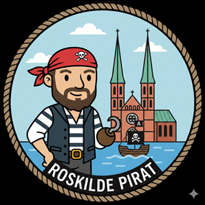

# Coding Pirates Roskilde

Dette repo indeholder materiale, kodeøvelser, eksempler, programmer og spil for Coding Pirates Roskilde afdeling.

## Materiale

Materialet kan findes i undermapper

- [2026 Forårssæson](./2026%20Forår/)
- [2025 Efterårssæson](./2025%20Efterår/)

## Links

### PictoBlox

- [PictoBlox](https://pictoblox.ai/)
- [PictoBlox Link](https://thestempedia.com/product/pictoblox/pictoblox-link/)

### Scratch

- [Scratch](https://scratch.mit.edu/projects/editor/)
- [Scratch Link](https://scratch.mit.edu/download/scratch-link)

### MakeCode

- [MakeCode hovedside](https://www.microsoft.com/en-us/makecode)
- [MakeCode arcade](https://arcade.makecode.com/)
- [MakeCode microbit](https://makecode.microbit.org/)

### Coding Pirates

- [Coding Pirates](https://codingpirates.dk/)
- [Medlemssystemet](https://members.codingpirates.dk/)
- [Roskilde afdeling](https://codingpirates.dk/roskilde/)

## Andet

God pirat-kodning!

