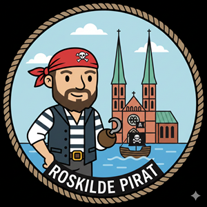

# Coding Pirates Roskilde

Dette repo indeholder materiale, kodeøvelser, links, eksempler, programmer og
spil for Coding Pirates Roskilde afdeling. Materialet kan findes i undermapper

- [2026 Forårssæson](./2026%20Forår/)
- [2025 Efterårssæson](./2025%20Efterår/)

## Forløb

I forårssæson 2026 kører vi to forløb

1. `Grafisk programmering` (PictoBlox, Scratch, Microbit)
2. `Python programmering`

Hvis det er første gang du er her, hiv fat i en instruktør. Vi anbefaler at du
derefter prøver øvelsen [Dodge Falling
Balls](./2025%20Efterår/Grafisk/Dodging%20Falling%20Balls/) (Undgå Faldende
Bolde) hvor du lærer en masse forskellig PictoBlox funktioner.

## Regler og praktik

Vi spiller kun de spil vi selv laver!

Ræk hånden op hvis du har brug for hjælp!

En normal dag består af

- `17:00 - 18:00` Intro og del 1
- `18:00 - 18:10` Pause
- `18:10 - 19:00` Del 2 og tak for i dag

Wifi/internet: Vælg `RTS-Guest`. Skriv mobilnummer og du får kode.

## Links

### PictoBlox

- [PictoBlox](https://pictoblox.ai/)
- [PictoBlox Link](https://thestempedia.com/product/pictoblox/pictoblox-link/)

### Python

Programmering i virker absolut bedst med lokalt installeret [VS
Code](https://code.visualstudio.com/) samt Python.

Men det kan du måske ikke hvis du har en skolecomputer. Simpleste og mest
tilgængelige er

- [PictoBlox](https://pictoblox.ai/): Kan kode Python, naturligt sted at
  fortsætte fra at kode Blocks. Vi kender programmet allerede

Måske virker også dette lokale alternativ

- [Thonny Python IDE](https://thonny.org/): Smart, har en simpel mode
  - Kan hentes i en variant som ikke kræver installation og inkluderer Python i
    pakken - vælg Portable pakken

Andre online alternativer er

- [Insiders VS Code for Web](https://insiders.vscode.dev?vscode-coi=)
  - Kræver GitHub konto, som desværre kræver alder 13+
  - Læs [VS Code for Web med Run and Debug
    Python](https://code.visualstudio.com/docs/python/python-web)
  - Husk extension [Experimental - Python for the
    Web](https://marketplace.visualstudio.com/items?itemName=ms-vscode.vscode-python-web-wasm)
  - Åbn fx [cp-roskilde/kode](https://github.com/cp-roskilde/kode) (dette) når
    det er på plads, så kan den afvikle Python
- [Trinket](https://jumpto.cc/python-new): Simpel, men lukker august 2026

### Scratch

- [Scratch](https://scratch.mit.edu/projects/editor/)
- [Scratch Link](https://scratch.mit.edu/download/scratch-link)

### MakeCode

- [MakeCode hovedside](https://www.microsoft.com/en-us/makecode)
- [MakeCode arcade](https://arcade.makecode.com/)
- [MakeCode microbit](https://makecode.microbit.org/)

### Coding Pirates

- [Coding Pirates](https://codingpirates.dk/)
- [Medlemssystemet](https://members.codingpirates.dk/)
- [Roskilde afdeling](https://codingpirates.dk/roskilde/)

## Andet

God pirat-kodning!

